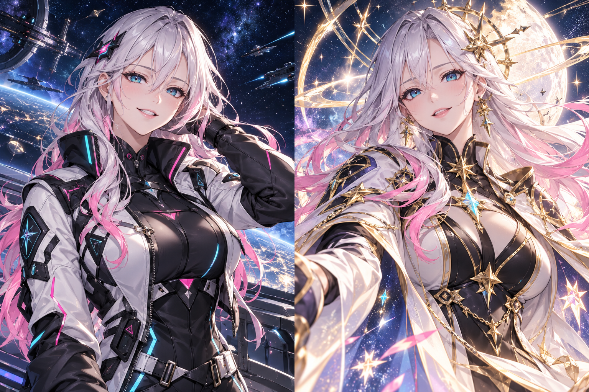

# ✦ STARFORGE — 星屑ときみの航海

美少女航海士 **ルミナ** と星を集める、日本語のスロット・インクリメンタルゲーム。課金も賭け金もなく、毎回必ず資源が増えます。



## 遊び方

- **SPIN / スペースキー**で採掘。5種類の役、最大100倍の大当たり。
- 30回ごとに次の5回が5倍。99回大当たりが出なければ次は必ず大当たり。
- 7種の設備で自動生産。各25基で設備生産が倍増。
- 4種の研究で採掘・自動スピン・生産・絆を強化。
- スピンでルミナとの絆を育成。Lv.3で20秒間の3倍スキル、Lv.10で覚醒イラストを解放。
- ミッション・図鑑・7つの宙域。10万ダスト以上の周回獲得から転生でき、恒久倍率を積み重ねられます。
- ブラウザに自動保存。最大8時間の留守中設備生産、セーブの書き出し／読み込みに対応。
- スマートフォン、キーボード、動きを減らすOS設定に対応。効果音は初期OFF。

## 起動

依存パッケージ・ビルド不要。Python 3で:

```sh
python3 -m http.server 8000 --directory dist
```

http://localhost:8000 を開いてください。ES Modulesを使用するため、HTMLの直接ダブルクリックではなくHTTPサーバーから開きます。

`dist/` をそのまま静的ホスティングに配置できます。セーブはブラウザのオリジン別です。URLを変更する場合は事前に書き出してください。自動スピンは前景表示中のみ、留守中は設備生産のみ計算します。

## 検証

Node.js 22以上:

```sh
npm test
```

抽選境界・大当たり保証・フィーバー回数・購入・留守中生産・転生・スキル・ミッション・セーブ検証・長期シミュレーションをテスト。GitHub Actionsでも実行します。

## 構成

- `dist/engine.js`: DOM非依存のゲーム計算
- `dist/app.js`: UI・演出・音・保存
- `dist/style.css`: レスポンシブ画面
- `dist/assets/lumina.png`: 生成したオリジナルキャラクター（左右に通常／覚醒）
- `tests/engine.test.js`: ゲームロジックの自動テスト

外部依存は任意のGoogle Fontsのみ。取得不可時はシステムフォントで動作します。実績解除等の外部通信はありません。WebMCP対応環境では読み取り専用の進行確認ツールを登録します（対応ブラウザでの実行検証は未実施）。

## 画像制作

内蔵ImageGenで制作。プロンプトは [ART_PROMPT.md](ART_PROMPT.md) を参照。
